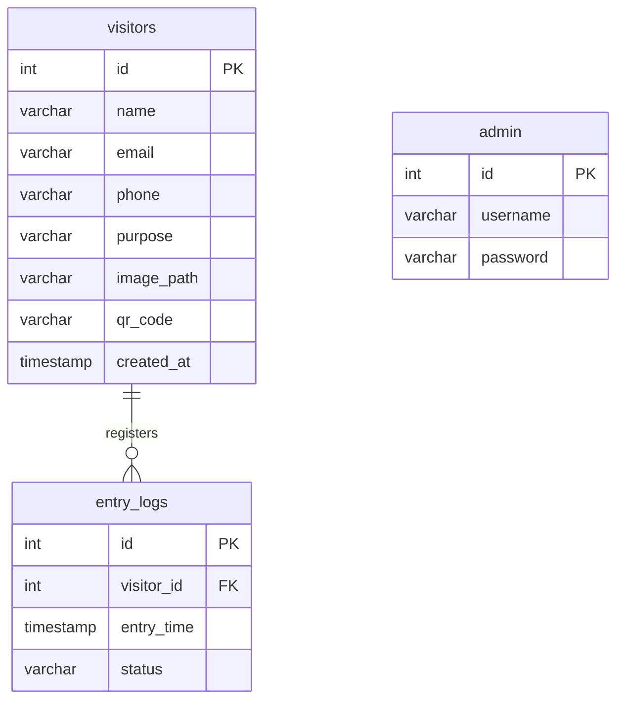
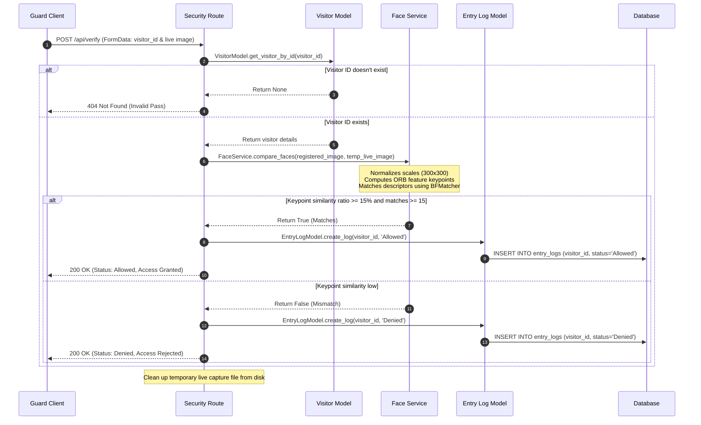

# AI Smart Gate Access Management System - Project Walkthrough

Welcome to the AI Smart Gate Access Management System. This project replaces traditional manual paper-based visitor logs with a modern, secure, full-stack application using digital QR verification passes, webcam capture, and OpenCV-based face verification.

---

## 1. How the System Works

The platform operates across three main user roles:

1.  **Visitor Registration**:
    *   Visitors access the registration page and input their name, email, phone, and purpose of visit.
    *   They upload a clear portrait photograph.
    *   The system uses **OpenCV face cascades** on the server to detect if a valid human face exists. If yes, it saves the details in a MySQL database, generates a QR code gate pass containing their unique visitor ID, and emails the pass.
2.  **Security Gate Verification**:
    *   When the visitor arrives at the gate, they present their QR gate pass.
    *   The security guard uses the console webcam to capture a live photograph of the visitor and scans/inputs their ID.
    *   The system extracts the visitor's original registration photo and uses **OpenCV ORB feature descriptor matching** to compare facial characteristics.
    *   If a match is found, entry is **Allowed**; otherwise, it is **Denied**. The event is logged in the database.
3.  **Administration Panel**:
    *   Admins log in using administrative credentials.
    *   They access a dashboard summarizing stats (total visitors, total entries, successful entries, and denials) and monitor log history feeds containing full details.

---

## 2. Directory Layout & Folder Structure

The project is structured as a clear, decoupled monorepo:

```text
AI-Smart-Gate-System/
├── schema.sql                 # MySQL table schemas & admin seeding scripts
├── .gitignore                 # Excludes caches, dependencies, and test uploads
├── walkthrough.md             # This comprehensive project architecture documentation
├── backend/
│   ├── app.py                 # Flask server initialization, CORS setup, and static folders mapper
│   ├── config.py              # Application configuration parameters (uploads limits, db/email settings)
│   ├── database.py            # MySQL thread-safe Connection Pool & reusable query execution utilities
│   ├── requirements.txt       # Backend dependencies (Flask, OpenCV, QRcode, Pillow, etc.)
│   ├── models/
│   │   ├── visitor_model.py   # SQL logic to create, read, and list visitor records
│   │   ├── entry_log_model.py # SQL logic to log check-in attempts and fetch joint lists
│   │   └── admin_model.py     # SQL logic to retrieve admin accounts
│   ├── routes/
│   │   ├── visitor_routes.py  # Controller: POST /api/register & GET /api/visitors
│   │   ├── admin_routes.py    # Controller: POST /api/admin/login & GET /api/logs
│   │   └── security_routes.py # Controller: POST /api/verify (QR parsing + ORB Face Verification)
│   ├── services/
│   │   ├── qr_service.py      # QR code generator service using qrcode[pil]
│   │   ├── email_service.py   # SMTP service sending passes with QR image attachments
│   │   └── face_service.py    # OpenCV Haar Cascades face detector and ORB descriptor comparisons
│   └── uploads/               # Local filesystem store for runtime assets
│       ├── qr_codes/          # Holds generated QR passes
│       └── visitor_images/    # Holds uploaded visitor photographs
└── frontend/
    ├── index.html             # Main index document loading Inter Google Font
    ├── package.json           # React dependencies list (Vite, Axios, Router, Lucide icons)
    ├── vite.config.js         # Hot module reload configuration and development server proxy setups
    └── src/
        ├── main.jsx           # React app mount point
        ├── App.jsx            # Router mapper establishing browser-side navigation
        ├── index.css          # Design system stylesheet (variables, glassmorphic card utilities)
        ├── services/
        │   └── api.js         # Axios API connection instance and backend services mapping
        └── pages/
            ├── Home.jsx       # Landing portal page
            ├── VisitorRegister.jsx # Registration form, validation, and pass modal
            ├── AdminLogin.jsx # Credentials form verification and session checks
            ├── AdminDashboard.jsx # Summary metrics counter and logs overview tables
            └── SecurityVerify.jsx # Check-in console (webcam capture frame and QR input simulator)
```

---

## 3. API Communication Flow

The frontend React client interacts with the Flask backend as follows:

```mermaid
graph TD
    subgraph Frontend React Client (Vite on Port 3000)
        Home[Home.jsx] --> |Links| Reg[VisitorRegister.jsx]
        Home --> |Links| Sec[SecurityVerify.jsx]
        Home --> |Links| Login[AdminLogin.jsx]
        Login --> |Redirects| Dash[AdminDashboard.jsx]
        
        Reg --> |visitorApi.register| Axios[api.js]
        Sec --> |securityApi.verify| Axios
        Login --> |adminApi.login| Axios
        Dash --> |adminApi.getLogs / visitorApi.getAll| Axios
    end

    subgraph Backend Python Flask (Port 5000)
        Axios -->|Proxy Target| Routes[Routes Registry]
        Routes -->|POST /api/register| VR[visitor_routes.py]
        Routes -->|POST /api/verify| SR[security_routes.py]
        Routes -->|POST /api/admin/login| AR[admin_routes.py]
        Routes -->|GET /api/logs| AR
        
        VR --> DB[(MySQL Database)]
        VR --> QR[qr_service.py]
        VR --> SMTP[email_service.py]
        SR --> DB
        SR --> CV[face_service.py - OpenCV ORB]
        AR --> DB
    end
```

---

## 4. Database Flow

The system runs on a relational MySQL database containing three tables linked by foreign key relationships:



*   **visitors**: Holds the profile and paths of physical face uploads and generated QR codes.
*   **entry_logs**: Records gate entries and has a foreign key referencing the `visitors` table.
*   **admin**: Holds administrator usernames and passwords for credential matching.

---

## 5. Authentication Flow

Admin portal access uses the following flow:

1.  **Form Input**: Admin enters `username` and `password` inside [AdminLogin.jsx](file:///c:/Users/Harish%20Gubbala/OneDrive/Desktop/AI-Smart-Gate-System/frontend/src/pages/AdminLogin.jsx).
2.  **API Verification**: The client sends a request (`POST /api/admin/login`) with the parameters.
3.  **Database Lookup**: The backend queries the database for the user:
    `SELECT * FROM admin WHERE username = %s`.
4.  **Credential Check**: The backend compares the passwords. If successful, it returns a `200 OK` JSON response.
5.  **Session Cache**: The client stores `isAdminAuthenticated` as `'true'` in local storage.
6.  **Route Protection**: The [AdminDashboard.jsx](file:///c:/Users/Harish%20Gubbala/OneDrive/Desktop/AI-Smart-Gate-System/frontend/src/pages/AdminDashboard.jsx) runs session verification inside `useEffect`. If not logged in, it redirects back to `/login`.

---

## 6. QR Code + OpenCV Face Verification Flow

This is the system's core security check-in flow:



### OpenCV Computer Vision Mechanics
1.  **Face Registration Detection**: When registering, [FaceService.detect_face](file:///c:/Users/Harish%20Gubbala/OneDrive/Desktop/AI-Smart-Gate-System/backend/services/face_service.py) loads the image, converts it to grayscale, and runs a Haar Cascade Classifier. If no face is found, the API rejects the request.
2.  **ORB Alignment Comparison**:
    *   Both the registered photo and the live capture photo are converted to grayscale and resized to $300 \times 300$ pixels.
    *   An ORB detector extracts up to 500 feature keypoints and BRIEF descriptor vectors.
    *   A Brute-Force Matcher matches descriptors using Hamming Distance (optimal for ORB binary descriptors).
    *   Matches with a distance of less than `50` are counted as good matches.
    *   Verification requires a minimum of 15 good matches and a matching ratio of 15% or higher to grant access.
